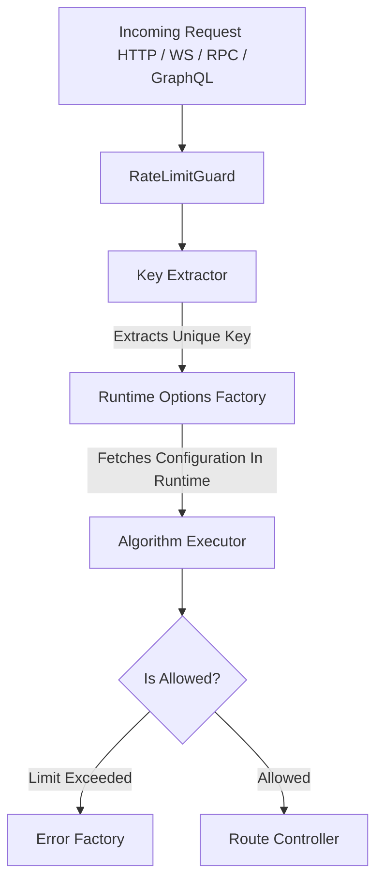

# Architecture

This document outlines the internal architecture, design patterns, and data flow of this library. It serves as a guide for contributors looking to understand how the codebase is structured and how components interact.

## Design Philosophy & Core Goals

Unlike standard rate limiters, this library is built with four core architectural principles:
* **Protocol Agnostic:** It does not rely on HTTP-specific objects (like Express `Request`). It handles HTTP, WebSockets, GraphQL, and RPC (gRPC) seamlessly via custom Key Providers.
* **Algorithm Flexibility:** It decouples the rate-limiting logic from the storage layer, allowing execution of 5 different algorithms dynamically.
* **Driver Independence:** It abstracts away the Redis library implementation (e.g., `ioredis`, `redis`). Users can plug in any client using a lightweight Adapter pattern.
* **Runtime Extensibility:** Strategy options and error behaviors are resolved dynamically at runtime via Factories.

## Conceptual Architecture (Data Flow)

When a request enters the NestJS lifecycle, it is intercepted before reaching the Route Handler.



## Library Structure

```text
├── lua/                # Lua scripts
├── src/                # Library code
│   ├── config/             # Configuration & Options types         
│   ├── custom/             # Custom providers functionality 
│   ├── decorators/         # Exported Decorators                
│   ├── executors/          # Algorithms implementations (algorithm & storage combinations) 
│   ├── middleware/         # Exported middleware (RateLimitGuard) 
│   ├── services/           # Additional providers
│   └── shared/             # Infrastructure code
```