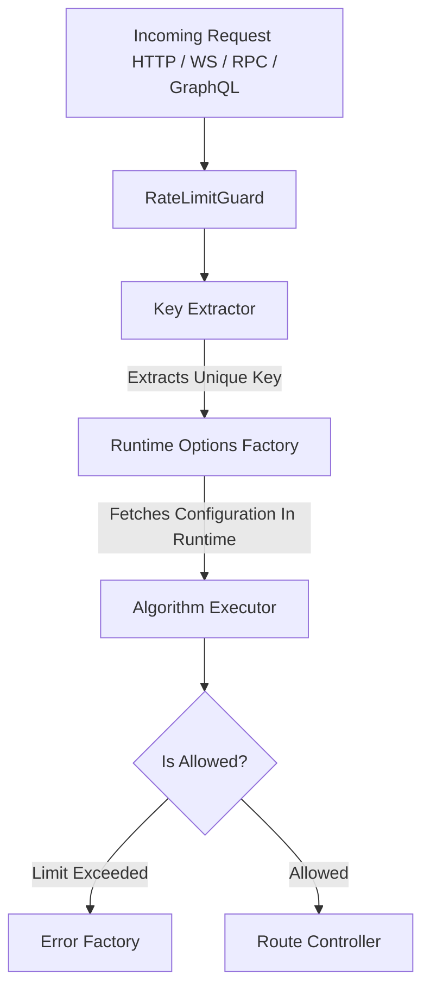

# Architecture

This document outlines the internal architecture, design patterns, and data flow of this library. It serves as a guide for contributors looking to understand how the codebase is structured and how components interact.

## Design Philosophy & Core Goals

Unlike standard rate limiters, this library is built with four core architectural principles:

- **Algorithm Flexibility:** It decouples the rate-limiting logic from the storage layer, allowing execution of 5 different algorithms dynamically.
- **Race-Condition Safe:** Library should provide atomic rate limiting logic to prevent race conditions in multi-instance deployments.
- **Driver Independence:** It abstracts away the Redis library implementation (e.g., `ioredis`, `redis`). Users can plug in any client using a lightweight Adapter pattern.
- **Protocol Agnostic:** It does not rely on HTTP-specific objects (like Express `Request`). It handles HTTP, WebSockets, GraphQL, and RPC (gRPC) seamlessly via custom Key Providers.
- **Runtime Extensibility:** Strategy options and error behaviors are resolved dynamically at runtime via Factories.

## Conceptual Architecture (Data Flow)

When a request enters the NestJS lifecycle, it is intercepted before reaching the Route Handler.



## Library Structure

```python
├── lua/                # Lua scripts
├── src/                # Library code
│   ├── config/             # Configuration & Options types
│   ├── custom/             # Custom providers functionality
│   ├── decorators/         # Exported Decorators
│   ├── executors/          # Algorithms implementations (algorithm & storage combinations)
│   ├── services/           # Additional providers
│   └── shared/             # Infrastructure code
```

## Architectural Components

### Algorithms

The library supports 5 distinct strategies out of the box:

1. **Fixed Window:** Simple time-block resetting.
2. **Token Bucket:** Smooth token generation over time.
3. **Sliding Window Counter:** Low-memory approximation of sliding logs.
4. **Sliding Window Log:** High-precision timestamp logging.
5. **Leaky Bucket:** Constant outflow rate monitoring.

### Storage

The storage layer is defined by strict abstraction interfaces.

- **In-Memory Storage:** Uses native JavaScript `Map` collections.
- **Distributed Storage (Redis):** Executes highly optimized **Lua scripts** to perform atomic operations in multi-instance deployments.
- **Redis Client Adapter:** To prevent tight coupling with a specific Redis client, the library interacts solely with a generic interface wrapper. Users pass their existing Redis instance into this adapter.

### Data Flow Providers

Library contains such types of data flow providers:

1. **Executors:** Providers that performs rate limiting logic for certain combination of algorithm and storage type (for example, **Token Bucket** algorithm for `Redis` storage).
2. **Key Extractors:** Providers that allow developers to provide custom key generation mechanism. This providers make the library protocol-agnostic.
3. **Error Factories:** Providers that allow developers to provide custom rate limiting error and perform some extra-logic when rate limit exceeded (for example, logging).
4. **Options factories:** Providers that allow developers to configure rate limiting at runtime (per request context).

### Extra-Providers

There are some extra-providers to to carry out secondary tasks:

1. `InMemoryGarbageCollector`: Provider that collects _dead_ rate limiting data records from `Map` storage.
2. `ProvidersResolved`: Providers that search for custom providers when module inits and cache them to provide high-speed access for this providers in runtime.
