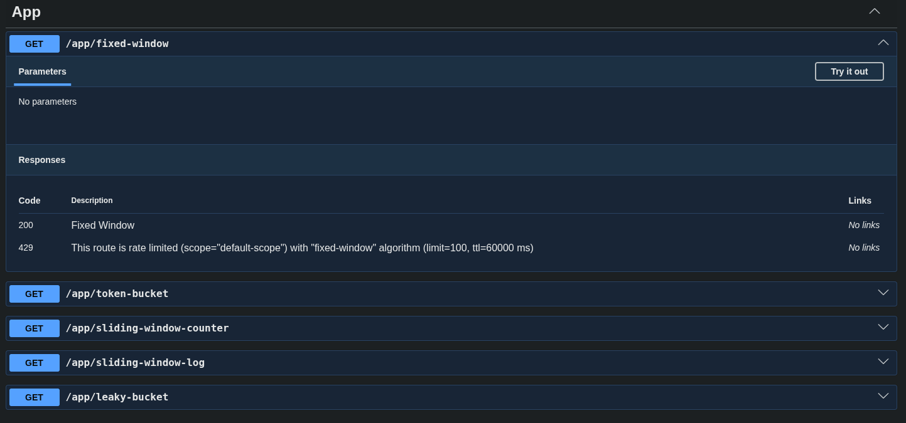
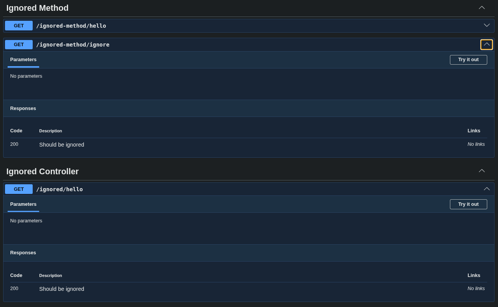
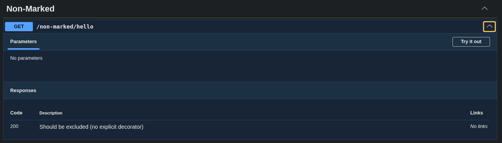
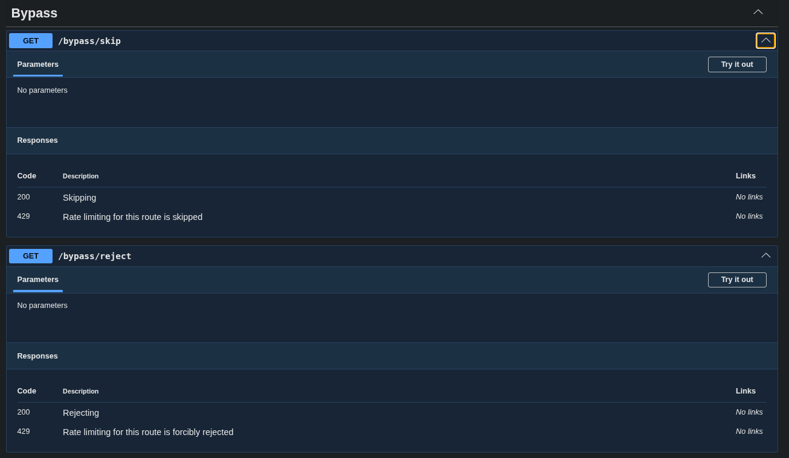
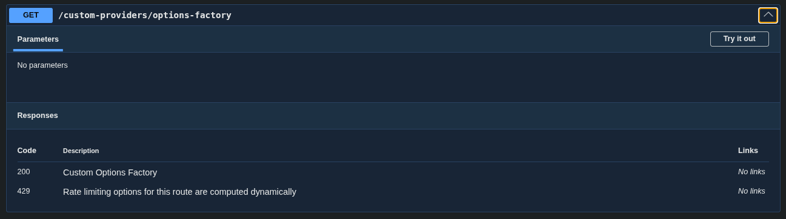

# Swagger Integration

Let's learn how to integrate `nestjs-multi-limiter` with your existing Swagger docs.

## Basic Example

Let's create example controller:

```typescript title="app.controller.ts" 
@Controller("app")
@ApiTags("App")
@UseGuards(RateLimitGuard)
export class AppController {
    public constructor(@Inject(AppService) private readonly appService: AppService) {}

    @Get("fixed-window")
    @ApiOkResponse({ description: "Fixed Window" })
    @RateLimit({ strategy: "fixed-window" })
    public fixedWindow() {
        return this.appService.hello();
    }

    @Get("token-bucket")
    @ApiOkResponse({ description: "Token Bucket" })
    @RateLimit({ strategy: "token-bucket" })
    public tokenBucket() {
        return this.appService.hello();
    }

    @Get("sliding-window-counter")
    @ApiOkResponse({ description: "Sliding Window Counter" })
    @RateLimit({ strategy: "sliding-window-counter" })
    public slidingWindowCounter() {
        return this.appService.hello();
    }

    @Get("sliding-window-log")
    @ApiOkResponse({ description: "Sliding Window Log" })
    @RateLimit({ strategy: "sliding-window-log" })
    public slidingWindowLog() {
        return this.appService.hello();
    }

    @Get("leaky-bucket")
    @ApiOkResponse({ description: "Leaky Bucket" })
    @RateLimit({ strategy: "leaky-bucket" })
    public leakyBucket() {
        return this.appService.hello();
    }
}
```

Now let's add swagger docs.

To patch Swagger docs with rate limiting metadata you should call `RateLimiterSwaggerModule.patch` method like here:

```typescript title="main.ts"
import { RateLimiterSwaggerModule } from "nestjs-multi-limiter/swagger"

async function bootstrap() {
    const app = await NestFactory.create(AppModule);

    const config = new DocumentBuilder().setTitle("API").setDescription("API description").setVersion("1.0").build();

    // Patching Swagger docs with rate limiting metadata
    RateLimiterSwaggerModule.patch(app);

    const document = SwaggerModule.createDocument(app, config);

    SwaggerModule.setup("docs", app, document);

    await app.listen(3000);
}
```

Now, if you starts your application and navigate to Swagger docs you should see something like this:



## Configuration

You can customize Swagger ocs patching using optional second parameter of `RateLimiterSwaggerModule.patch` method. Second parameter has such type:

```typescript
type RateLimiterSwaggerConfig = {
    /**
     * A custom transformer function for fine-tuning the OpenAPI specification.
     *
     * Allows you to completely overwrite or dynamically extend the `ApiResponseOptions` object
     * based on the resolved rate limit options of a specific endpoint.
     */
    transform?: (options: RateLimitOptions) => ApiResponseOptions;

    /**
     * A list of exclusions to prevent automatic documentation.
     *
     * You can pass strings in two formats:
     * 1. Controller class name — disables 429 error documentation for the entire controller.
     * 2. `Controller.Method` format — disables documentation for a specific endpoint.
     */
    excludeRoutes?: string[];

    /**
     * Strict (explicit) documentation strategy for rate limits.
     *
     * - `true`: The 429 error will appear in the Swagger UI **only** for methods or controllers
     *   where the `@RateLimit()` decorator is explicitly attached. Global default options
     *   defined during module initialization will be ignored for undocumented routes.
     * - `false`: The entire project will be documented automatically. Endpoints without
     *   the decorator will display global default rate limits.
     *
     * @default false
     */
    explicitOnly?: boolean;
};
```

### Ignoring Routes

You can ignore rate limiting metadata patching for particular routes/controllers.

Let's setup controllers:

```typescript title="controllers.ts"
@Controller("ignored")
@ApiTags("Ignored Controller")
@UseGuards(RateLimitGuard)
@RateLimit({})
export class IgnoredController {
    public constructor(@Inject(AppService) private readonly appService: AppService) {}

    @Get("hello")
    @ApiOkResponse({ description: "Should be ignored" })
    public hello() {
        return this.appService.hello();
    }
}

@Controller("ignored-method")
@ApiTags("Ignored Method")
@UseGuards(RateLimitGuard)
@RateLimit({})
export class IgnoredMethodController {
    public constructor(@Inject(AppService) private readonly appService: AppService) {}

    @Get("hello")
    @ApiOkResponse({ description: "Should not be ignored" })
    public hello() {
        return this.appService.hello();
    }

    @Get("ignore")
    @ApiOkResponse({ description: "Should be ignored" })
    public ignore() {
        return this.appService.hello();
    }
}
```

Now, you can ignore metadata patching for this controllers:

```typescript title="main.ts"
RateLimiterSwaggerModule.patch(app, {
    excludeRoutes: [IgnoredController.name, `${IgnoredMethodController.name}.ignore`]
});
```

Now you should see something like this in your Swagger docs:




### Patching explicit-only routes

You can disable metadata patching for routes, that no have explicit `@RateLimit` decorator.

Let's setup controller:

```typescript title="controller.ts"
@Controller("non-marked")
@ApiTags("Non-Marked")
@UseGuards(RateLimitGuard)
export class NonMarkedController {
    @Get("hello")
    @ApiOkResponse({ description: "Should be excluded (no explicit decorator)" })
    public hello() {
        return { success: true };
    }
}
```

Now, you can ignore metadata patching for this controller:

```typescript title="main.ts"
RateLimiterSwaggerModule.patch(app, {
    explicitOnly: true
});
```

Now you should see something like this in your Swagger docs:




## Default Configuration

Let's look how `nestjs-multi-limiter` adds `429` response metadata by default.

### Bypassing

We have such controller:

```typescript title="controller.ts"
@Controller("bypass")
@ApiTags("Bypass")
@UseGuards(RateLimitGuard)
export class BypassController {
    public constructor(@Inject(AppService) private readonly appService: AppService) {}

    @Get("skip")
    @ApiOkResponse({ description: "Skipping" })
    @SkipRateLimit()
    public skip() {
        return this.appService.hello();
    }

    @Get("reject")
    @ApiOkResponse({ description: "Rejecting" })
    @RejectRateLimit()
    public reject() {
        return this.appService.hello();
    }
}
```

This controller skips first method and forcibly rejects second method. In Swagger docs it will be look so:




### Dynamic Options

We have such controller:

```typescript title="controller.ts"
@Controller("custom-providers")
@ApiTags("Custom Providers")
@UseGuards(RateLimitGuard)
export class CustomProvidersController {
    public constructor(@Inject(AppService) private readonly appService: AppService) {}

    // ...

    @Get("options-factory")
    @ApiOkResponse({ description: "Custom Options Factory" })
    @RateLimit({ factory: CustomOptionsFactory })
    public optionsFactory() {
        return this.appService.hello();
    }
}
```

Rate limit options for this method are calculated in runtime. In Swagger docs it will be look so:


